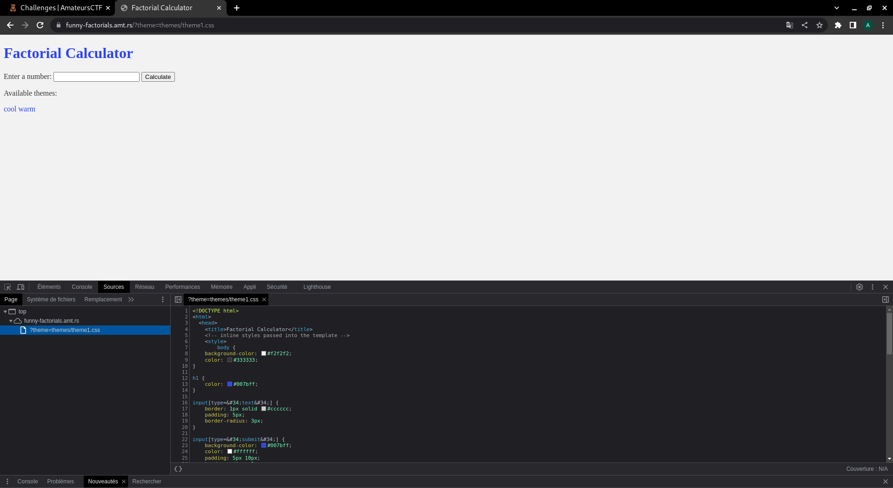
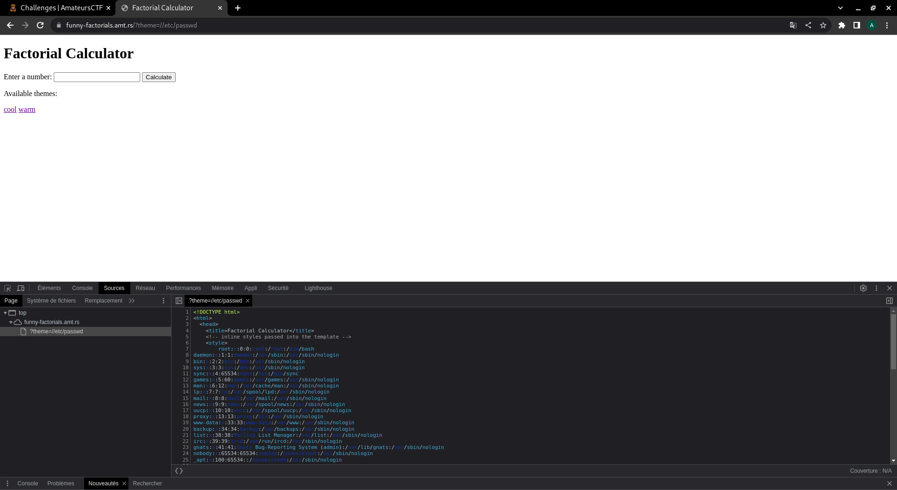

<h1> Funny-factorials </h1>

This challenge is also written with python and we can immediately notice an interesting parameter in the url which manages the CSS theme.

In the source code we will focus on the function filter_path because if we understand how to filter the user input we can more easily bypass the filter to perform an LFI.

And indeed the filter_path function is poorly coded because the path variable only removes the first "/". So if we put 2 slashes the first will be erased and we will have a
valid path to the root of the server.

